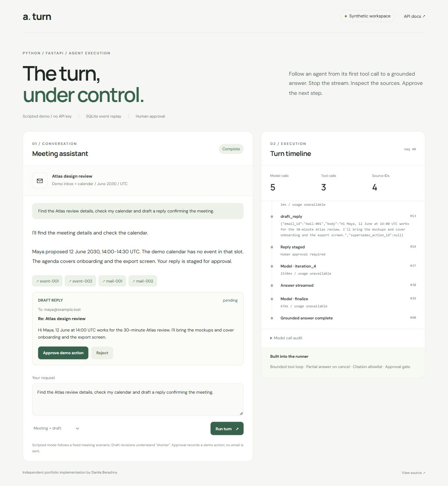

# Agentic Turn Demo

An inspectable **Python + FastAPI** agent turn: tools, streamed answers, cancellation,
durable event replay, source validation and a human approval gate.

Independent portfolio implementation by **Danila Berazhny**, based on engineering
patterns he worked on in a commercial assistant. The implementation, prompts,
fixtures and documentation in this repository were created for this demo.
All emails, identities and calendar records are synthetic.



## Run in two minutes

Python 3.12 or newer:

```bash
python -m venv .venv
source .venv/bin/activate
pip install -r requirements-dev.lock
pip install --no-deps -e .
uvicorn agentic_turn.api:app --host 127.0.0.1 --port 8000 --workers 1
```

On Windows, activate with `.venv\Scripts\Activate.ps1` instead.
Open **http://localhost:8000**. API documentation is at **http://localhost:8000/docs**.
Default mode uses a scripted provider and requires **no API key**. It executes the
same runner, tools, persistence, cancellation and approval paths as the live adapter.
The script always follows the Atlas meeting scenario; free-form requests require live mode.

Or use Docker:

```bash
docker compose up --build
```

## What to try

1. **Meeting + draft**: search the inbox, check the calendar, inspect source records,
   then approve or reject the staged reply. Approval records an `executed_demo` action.
2. **Stop turn** while text is streaming. The provider read is interrupted, partial
   text survives, staged actions are discarded and structured finalization is skipped.
3. **Reload** during a turn. The browser restores the persisted snapshot and replays
   sequenced events; disconnecting a browser does not cancel server execution.
4. Ask **"Make the reply shorter"** after leaving a draft pending. The replacement
   supersedes the previous draft, which can no longer be approved.
5. Select **Tool error + recovery**, **Invalid citation + repair**, or **Iteration limit**
   to inspect recovery, bounded citation repair and a terminal failure.

## Engineering behavior

| Concern | Implementation |
| --- | --- |
| Agent orchestration | Explicit async loop; at most 6 model iterations and 8 tool calls per reply |
| Model integration | Provider protocol; scripted adapter and Anthropic async SDK adapter |
| Output | Streamed text stays authoritative; separate typed outcome and citations |
| Source validation | Citations must reference IDs actually surfaced by this turn's tools; one repair attempt, then invalid IDs are filtered |
| Cancellation | Race each provider/tool await against a cancellation signal, including a stalled stream read |
| Durability | SQLite snapshot and event frame commit together before streaming |
| Reconnection | Per-turn sequence numbers, cursor replay and snapshot reconciliation |
| Identity | Server-resolved session ownership; no user or tenant argument accepted from the model |
| Actions | Stage, revise, approve or reject; decisions require a completed turn and are single-use |
| Observability | Per-call model, phase, duration, completion state and reported token usage; tool arguments and source IDs |

Source-ID validation establishes record membership, not entailment of every sentence.
The tool-data envelope is an instruction boundary, not a guarantee against prompt injection.

## Live model mode

Choose a model available to your account that supports tool use, streaming and structured output:

```bash
export LLM_PROVIDER=anthropic
export ANTHROPIC_API_KEY='your-own-key'
export ANTHROPIC_MODEL='your-model-id'
uvicorn agentic_turn.api:app --host 127.0.0.1 --port 8000 --workers 1
```

For Docker, set these variables in a local `.env` file using `.env.example` as a template.
That file is ignored by Git and excluded from the image. Live mode makes paid API calls
with your key; demo data is still synthetic. Fault-injection scenario selection applies
only to the scripted provider. No automatic SDK retries are enabled; the runner owns its budgets.
Token usage is `null` in scripted mode and for calls interrupted before usage is available.

## Verify

```bash
ruff check .
ruff format --check .
pytest -q
```

Tests cover the runner and HTTP API, cancellation while waiting for the model,
partial results after failure, timeout, citation repair, iteration limits, ownership,
draft revision, duplicate approval, replay, restart recovery and the Anthropic SDK
adapter through a simulated HTTP stream. Tests make no live API calls.

## Scope and tradeoffs

- This is a local portfolio application. Demo session tokens isolate conversations;
  they are not a complete account/authentication system for an internet-facing service.
- Run **one server worker**. SQLite stores durable data; in-process tasks execute turns.
  Multiple workers would need a shared queue, distributed locks and a cancellation channel.
- Restarting the process marks unfinished turns `interrupted`, preserves partial text
  and discards their drafts. It does not pretend to resume a lost provider stream.
- Approval operates on a synthetic outbox. There are no Gmail, calendar, finance or voice integrations.
- Data is retained in the local SQLite file. Clear `data/` and the browser's site storage
  together to start a fresh demo. No performance claims are inferred from scripted timing.

See [architecture](docs/architecture.md) and [API examples](docs/api.md).

SDK implementation references: [FastAPI streaming responses](https://fastapi.tiangolo.com/advanced/custom-response/#streamingresponse),
[Anthropic streaming](https://platform.claude.com/docs/en/build-with-claude/streaming),
[typed structured outputs](https://platform.claude.com/docs/en/build-with-claude/structured-outputs).

MIT licensed.
