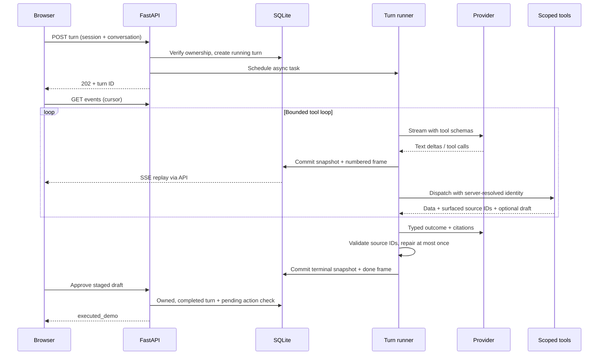

# Architecture

## Boundaries

- `engine.py` owns orchestration, cancellation, budgets, telemetry and terminal states.
- `providers.py` contains the model protocol, a deterministic script and the SDK adapter.
  The live adapter preserves native tool-use blocks and returns usage per call,
  without shared mutable counters between concurrent conversations.
- `tools.py` validates arguments with strict Pydantic schemas and supplies synthetic records.
  Model arguments cannot select an owner or tenant. Drafts need an email ID from the current
  turn's ledger; replies use the retrieved sender, not a model-chosen address.
- `store.py` persists turn snapshots, events, sessions and draft actions. Every emitted
  frame commits with its snapshot. Draft mutations are committed before their notification;
  a fresh snapshot always includes the current actions even if a notification is missed.
- `api.py` checks ownership for every conversation, turn, event stream and action route.
- `static/` is a small dependency-free browser client. It renders model and record text
  with `textContent`, reconciles snapshots and ignores replayed deltas.

## Lifecycle

`running -> done | cancelled | error | interrupted`

A conversation accepts only one active turn in this server process. Independent
conversations may run concurrently. Tool errors become `is_error` results that the
model can recover from. An exhausted budget, timeout, truncated output or provider
failure terminates the turn with an error frame and retained partial text.

User cancellation races each awaited stream read and tool execution against an event.
The losing await is cancelled and drained. The async generator is closed, so the SDK's
stream context releases the HTTP connection. Finalization also observes cancellation.
Only completed turns enter subsequent conversation history.

Staged actions are `pending`, then `superseded`, `rejected`, `executed_demo` or `discarded`.
An action from a running turn cannot be approved. Failed, cancelled and interrupted turns
discard their pending drafts. A duplicate decision returns a conflict.

## Grounding boundary

Read tools return records and their IDs. The runner accumulates IDs in a per-turn ledger.
Typed finalization supplies an outcome and citations without replacing the visible text.
Text from successive model calls is separated by a persisted paragraph-break event,
so narration before tools and the final answer remain readable on replay as well.
The validator permits only IDs in the ledger; invalid IDs cause at most one repair call,
then remaining invalid citations are dropped. The original streamed transcript stays intact.
This checks source existence within the turn. It does not implement semantic fact checking.

## Reconnection and restart

Frames contain `turn_id`, `seq` and `type`. A client can request frames after a cursor or
send `Last-Event-ID`; replay is ordered and terminal snapshots match terminal frames.
The browser restores a snapshot before replay, so historical deltas cannot duplicate text.
A disconnected browser leaves the server task running.
The latest-turn lookup also recovers a turn whose POST response was lost on navigation.

A server restart cannot recover an in-flight HTTP stream. Startup therefore marks stale
running turns interrupted and keeps their partial content. A durable queue and provider
checkpoint strategy would be separate extensions for deployment across processes.

## Deliberate omissions

External side effects, OAuth, vector retrieval, voice, distributed workers and model
escalation are outside this example. These can be added behind provider/tool/storage
boundaries without obscuring the turn's central behavior. The SQLite adapter is optimized
for readability and a small local demo; synchronous database calls are not a claim of
high-throughput architecture.
